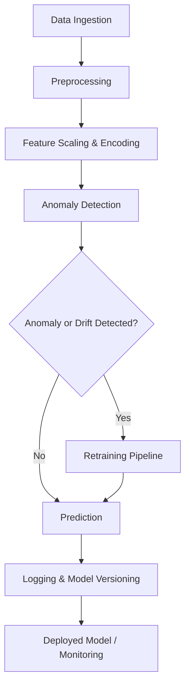

# Self-Healing ML Pipeline for Diabetes Prediction

## Project Overview

This project implements a **self-healing machine learning pipeline** for predicting diabetes progression using the **scikit-learn diabetes dataset**.

The pipeline is designed to automatically detect issues in incoming data and recover without manual intervention.

### What the pipeline handles

- Feature preprocessing (numeric scaling, categorical encoding)
- Anomaly detection and data cleaning
- Data drift monitoring
- Automatic retraining with versioned model storage
- Logging and metrics tracking

---

## Key Features

- ✅ Production-ready pipeline structure  
- ✅ Versioned models and metadata  
- ✅ Logging & alerting for anomalies and data drift  
- ✅ Easy extension to other datasets
  
## Pipeline Architecture



```
### Usage Example
from src.predictor import SelfHealingPredictor
import pandas as pd

#### Load new data
X_new = pd.read_csv("data/diabetes.csv")

#### Initialize predictor
predictor = SelfHealingPredictor(
    model_path="models/pipeline_20260101_120000.pkl",
    numeric_stats={...}  # statistics saved during training
)

#### Predict and self-heal if needed
predictions = predictor.predict(X_new, target_col="target")

print(predictions[:5])

self_healing_ml_pipeline/
│
├─ data/
│   └─ diabetes.csv          # Optional: dataset copy
│
├─ notebooks/
│   └─ exploratory_analysis.ipynb
│
├─ src/
│   ├─ pipeline.py           # Main pipeline code
│   ├─ predictor.py          # Self-healing predictor class
│   └─ utils.py              # Helper functions (logging, metrics)
│
├─ models/
│   └─ (versioned models stored here)
│
├─ logs/
│   └─ pipeline.log
│
├─ README.md
└─ requirements.txt
```
